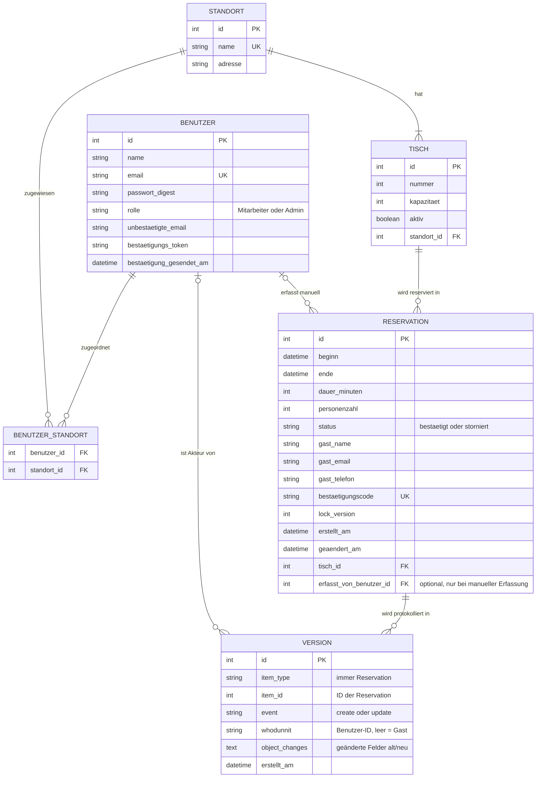
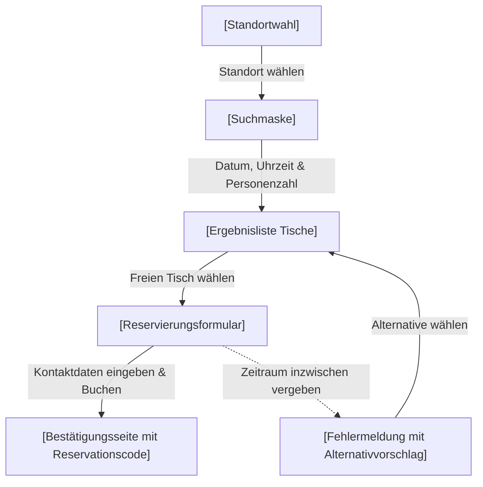
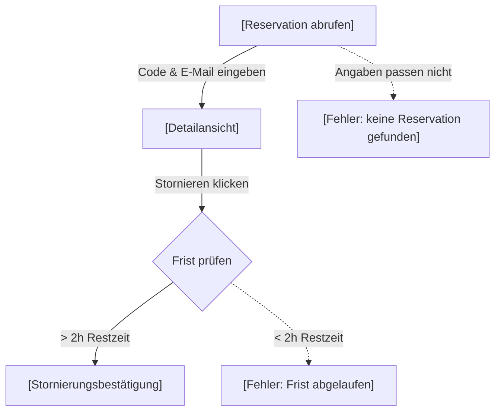
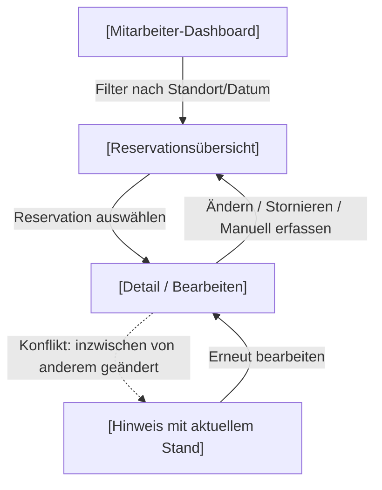
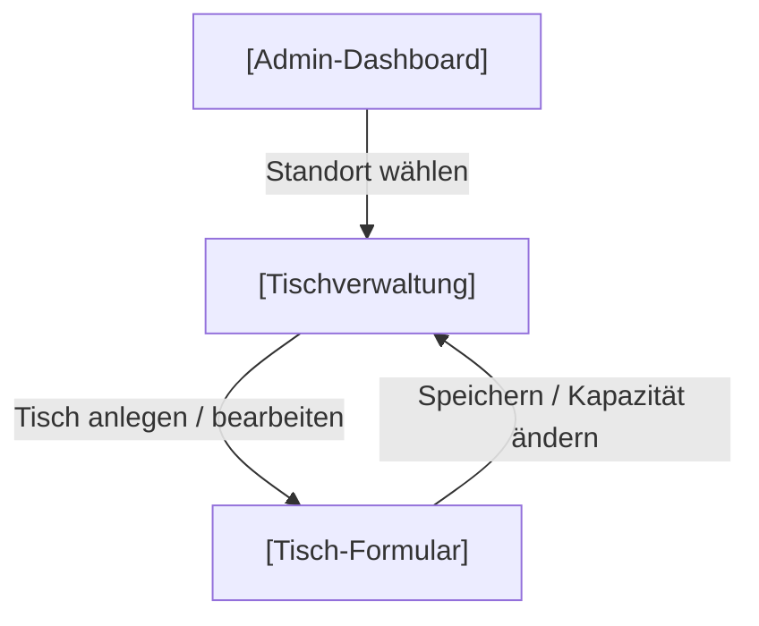
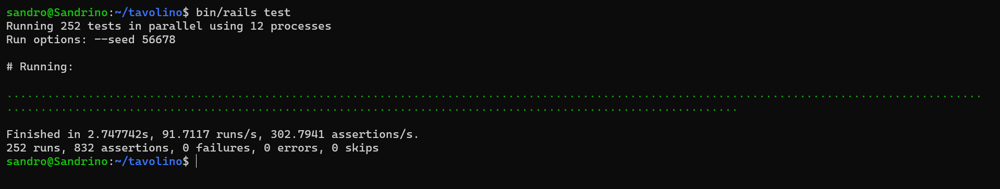
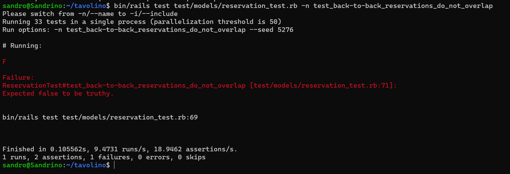

# Projektdokumentation: Tavolino-Tischreservation

**Modul:** 24-223-E Multi-User-Applikationen objektorientiert realisieren  
**Datum:** 25.09.2026 (Projektantrag vom 18.09.2026, überarbeitet am 21.09.2026 nach Feedback, weitergeführt als Projektdokumentation am 25.09.2026)  
**Autor:** Sandro Bucher  
**Schulklasse:** 24 E

---

## Inhaltsverzeichnis

- [1. Problemstellung](#1-problemstellung)
- [2. Projekt](#2-projekt)
- [3. Anforderungsanalyse](#3-anforderungsanalyse)
- [4. Änderungen nach dem Feedback (21.09.2026)](#4-änderungen-nach-dem-feedback-21092026)
- [5. Stand der Umsetzung](#5-stand-der-umsetzung)
- [6. Abweichungen vom Projektantrag](#6-abweichungen-vom-projektantrag)
- [7. Testing](#7-testing)
- [8. Prüfung der Anforderungen](#8-prüfung-der-anforderungen)
- [9. Offene Punkte](#9-offene-punkte)
- [10. Quellen](#10-quellen)

---

## 1. Problemstellung

Eine kleine Restaurant-Kette mit zwei Standorten und einer gemeinsamen Geschäftsleitung nimmt Tischreservationen aktuell ausschliesslich telefonisch entgegen. Die Mitarbeiter tragen die Reservationen anschliessend händisch in ein Reservationsbuch ein.

Dieses Vorgehen bringt für beide Seiten Nachteile:

- **Für das Restaurant:** Telefonate binden während der Stosszeiten Personal, das eigentlich für den Service benötigt wird. Übertragungsfehler beim händischen Eintragen (z. B. Zahlendreher bei Uhrzeit oder Personenzahl) können zu Doppelbelegungen oder falsch reservierten Tischgrössen führen. Zudem ist der Überblick über beide Standorte schwierig, da jedes Reservationsbuch separat geführt wird.
- **Für die Gäste:** Reservationen sind nur während der Öffnungszeiten des Restaurants (telefonisch) möglich. Es gibt keine sofortige, verlässliche Bestätigung, und bei zwei Gästen, die zur gleichen Zeit anrufen, entscheidet reiner Zufall bzw. das Geschick des Mitarbeiters am Telefon.

Aus **Kundensicht** (privater Kontext) ist die Problemstellung mir persönlich regelmässig begegnet: Es ist unpraktisch, ausserhalb der Geschäftszeiten keine Reservation vornehmen zu können, und es kam bereits vor, dass eine telefonisch zugesagte Reservation im Restaurant nicht auffindbar war, weil sie falsch übertragen wurde.

Eine digitale Multiuser-Applikation würde es Gästen ermöglichen, jederzeit online einen Tisch zu reservieren, während das Restaurant-Personal die Übersicht über beide Standorte zentral und fehlerfrei behält.

---

## 2. Projekt

### Domäne
Gastronomie / Tischreservation für eine Restaurant-Kette mit mehreren Standorten.

### Name der Applikation
**Tavolino-Tischreservation**

### Vision
Tavolino-Tischreservation ermöglicht Gästen, jederzeit online und ohne Benutzerkonto einen passenden Tisch an einem der Standorte zu reservieren – schnell, verlässlich und ohne Telefonanruf. Dem Restaurant-Personal verschafft die Applikation eine zentrale, fehlerfreie Übersicht über alle Reservationen an beiden Standorten und reduziert den Aufwand für die telefonische Reservationsannahme.

### Projektplanung: 1. MVP-Iteration
Die wichtigste domänenspezifische funktionale Anforderung der 1. Iteration ist:

> **Ein Gast kann für einen bestimmten Standort, ein Datum, eine Uhrzeit und eine Personenzahl einen passenden freien Tisch reservieren.**

Dafür benötigte Multiuser-Aspekte:
- Gleichzeitiger Zugriff mehrerer Gäste auf denselben Tischbestand (standort- und zeitbezogen)
- Überschneidungsfreie Vergabe: Prüfung auf Überschneidungen und Speichern der Reservation in **einer Transaktion**, damit nicht zwei Gäste denselben Tisch für sich überschneidende Zeiten erhalten
- Eindeutige, konsistente Bestätigung bzw. Ablehnung bei konkurrierenden Reservationsversuchen auf den letzten passenden freien Tisch
- **Optimistic Locking** bei gleichzeitiger Bearbeitung derselben Reservation durch mehrere Mitarbeiter (Locking-Anwendungsfall, siehe Abschnitt «Locking und Transaktionen»)
- Rollenbasierte Sicht: Mitarbeiter und Admin (mit Benutzerkonto) sehen und verwalten die Reservationen. Gäste benötigen kein Konto und verwalten ihre eigene Reservation über Reservationscode und E-Mail-Adresse.

---

## 3. Anforderungsanalyse

### Funktionale Anforderungen (priorisiert)

1. Als Gast (ohne Benutzerkonto) kann ich für einen Standort, ein Datum, eine Uhrzeit und eine Personenzahl einen freien, passend grossen Tisch reservieren.
2. Als Gast erhalte ich nach erfolgreicher Reservation eine sofortige, eindeutige Bestätigung mit allen Reservationsdetails und einem Reservationscode.
3. Als Mitarbeiter kann ich alle Reservationen meiner Standorte in einer Übersicht (z. B. nach Datum/Zeit) einsehen.
4. Als Gast kann ich meine Reservation mit Reservationscode und E-Mail-Adresse bis zu einer definierten Frist vor dem Termin stornieren.
5. Als Mitarbeiter kann ich eine Reservation manuell erfassen oder anpassen (z. B. bei telefonischen Ausnahmefällen). Ändert gleichzeitig eine andere Person dieselbe Reservation, wird der Konflikt erkannt und nichts still überschrieben.
6. Als Admin kann ich Tische (inkl. Kapazität) für beide Standorte verwalten (anlegen, bearbeiten, deaktivieren).
7. Als Gast werde ich bei einem nicht mehr verfügbaren Zeitslot mit einer verständlichen Meldung und einem Alternativvorschlag informiert.
8. Als Admin kann ich Mitarbeiter-Konten verwalten und Standorten zuordnen.

### Qualitätsattribute (nicht-funktional, priorisiert und überprüfbar)

1. **Datenkonsistenz:** Reservieren zwei Gäste gleichzeitig den letzten verfügbaren, passenden Tisch für denselben oder einen sich überschneidenden Zeitraum, wird genau eine Reservation bestätigt; die zweite Anfrage erhält innerhalb von 2 Sekunden eine Fehlermeldung mit Alternativvorschlag. Es entstehen nie zwei sich überschneidende, nicht stornierte Reservationen am selben Tisch.
2. **Performance:** Die Suche nach verfügbaren Tischen zeigt bei 500 erfassten Reservationen pro Standort und zehn gleichzeitigen Suchanfragen die Ergebnisse innerhalb von 2 Sekunden an.
3. **Konflikterkennung:** Speichert eine Person eine Reservation auf Basis eines veralteten Stands (weil eine andere Person sie inzwischen geändert hat), wird die Änderung abgelehnt, und die Person sieht eine verständliche Meldung mit dem aktuellen Stand. Es gehen keine Änderungen unbemerkt verloren.
4. **Nachvollziehbarkeit:** Jede Reservation, Stornierung und Änderung wird mit Zeitstempel und Akteur (Gast, Mitarbeiter oder Admin) protokolliert und ist für Mitarbeiter und Admin im Verlauf einsehbar.
5. **Sicherheit der Konten:** Passwörter der Mitarbeiter und Admins sind mindestens 12 Zeichen lang und werden ausschliesslich als Hash gespeichert. Die Anmeldung erlaubt keine Rückschlüsse darauf, ob eine E-Mail-Adresse existiert (keine Timing-basierte Enumeration). Reservationscodes sind nicht erratbar.

### Benutzerrollen

| Rolle | Berechtigungen |
|---|---|
| **Gast** (kein Konto) | Tische suchen und reservieren; die eigene Reservation mit Reservationscode und E-Mail-Adresse abrufen und stornieren |
| **Mitarbeiter** (Konto) | Reservationen der eigenen Standorte einsehen, manuell erfassen/anpassen/stornieren; eigenes Profil verwalten |
| **Admin** (Konto) | Alle Rechte des Mitarbeiters für beide Standorte, zusätzlich Verwaltung der Tische (Anlegen, Kapazität, Deaktivieren) und der Mitarbeiter-Konten (inkl. Standortzuweisung), Einsicht standortübergreifend |

**Konten für Mitarbeiter und Admin**

- Nur Mitarbeiter und Admins besitzen ein Benutzerkonto und melden sich mit E-Mail-Adresse und Passwort an. Gäste registrieren sich nie.
- Ein neu registriertes Konto hat die Rolle Mitarbeiter, ist aber keinem Standort zugeordnet und sieht deshalb keine Reservationen, bis ein Admin es einem Standort zuweist.
- Die Rolle Admin kann nur ein Admin vergeben. Der erste Admin wird bei der Einrichtung direkt in der Datenbank gesetzt.
- Mitarbeiter und Admins können ihr Profil (Name, Passwort) ändern. Eine neue E-Mail-Adresse wird erst nach Klick auf einen Bestätigungslink übernommen.

### Zusätzliche fachliche Regeln

- Die Tischgrösse (Kapazität) muss der angegebenen Personenzahl entsprechen bzw. diese abdecken.
- Eine Reservation hat eine Standarddauer (z. B. 2 Stunden); danach gilt der Tisch wieder als frei.
- Reservationen sind nur für Datum/Zeit in der Zukunft möglich.
- Stornierungen sind bis 2 Stunden vor dem reservierten Termin kostenlos möglich. Stornierte Reservationen blockieren den Tisch nicht mehr.
- Ein Tisch darf nicht doppelt belegt werden: Zwei nicht stornierte Reservationen am selben Tisch dürfen sich zeitlich nicht überschneiden (siehe nächster Abschnitt).
- Deaktivierte Tische können nicht neu reserviert werden.

### Locking und Transaktionen

#### Doppelbuchungen verhindern (Transaktion mit Überschneidungsprüfung)

Zwei Reservationen am selben Tisch überschneiden sich, wenn gilt:

> **Beginn A < Ende B  UND  Ende A > Beginn B**

Ein Unique-Index auf Tisch und Startzeit reicht dafür nicht aus, weil er nur exakt gleiche Startzeiten erkennt. Eine Reservation von 18:00 bis 20:00 Uhr und eine von 19:00 bis 21:00 Uhr am selben Tisch würden ihn beide passieren, obwohl sie sich überschneiden.

Beim Abschliessen einer Reservation läuft deshalb alles in **einer kurzen Datenbank-Transaktion**:

1. Der gewählte Tisch wird für die Dauer der Transaktion gesperrt (pessimistisch, nur Millisekunden). Parallele Buchungen auf denselben Tisch laufen dadurch nacheinander.
2. Es wird geprüft, ob eine nicht stornierte Reservation am Tisch die Überschneidungsbedingung erfüllt.
3. Ist der Zeitraum frei, wird die Reservation gespeichert und bestätigt. Sonst wird die Transaktion abgebrochen und der Gast erhält eine Fehlermeldung mit Alternativvorschlag (nächstliegende freie Zeit am selben Standort oder anderer Standort).

Es wird bewusst **keine Sperre über eine Benutzereingabe hinweg** gehalten. Der Gast wählt Tisch und Zeit, gibt seine Kontaktdaten ein und bucht. Ist der Zeitraum in der Zwischenzeit vergeben worden, erfährt er es beim Buchen.

#### Locking-Anwendungsfall: Optimistic Locking bei gleichzeitiger Bearbeitung

**Szenario:** Zwei Mitarbeiter (oder Mitarbeiter und Admin) öffnen dieselbe Reservation. Der eine ändert die Uhrzeit, der andere die Personenzahl. Ohne Schutz würde derjenige, der zuletzt speichert, die Änderung des anderen unbemerkt überschreiben («Last write wins»). Auch eine Stornierung durch einen Gast, während ein Mitarbeiter die Reservation bearbeitet, ist ein solcher Konflikt.

**Lösung:** Jede Reservation trägt eine Versionsnummer (`lock_version`). Beim Öffnen des Bearbeitungsformulars wird die aktuelle Version mitgeführt. Beim Speichern wird die Änderung nur übernommen, wenn die Version in der Datenbank noch dieselbe ist (`UPDATE ... WHERE lock_version = <erwartete Version>`), und die Version wird dabei erhöht.

- Stimmt die Version, wird die Änderung gespeichert.
- Stimmt sie nicht (jemand anderes war schneller), betrifft das Update keine Zeile. Die Änderung wird abgelehnt, und der Benutzer sieht die Meldung «Diese Reservation wurde inzwischen geändert» zusammen mit dem aktuellen Stand. Er kann danach bewusst erneut bearbeiten.

**Begründung:** Gleichzeitige Änderungen derselben Reservation sind selten. Optimistic Locking hält deshalb keine Sperre und braucht keinen Timer. Es passt zum zustandslosen Ablauf im Web, bei dem zwischen Öffnen und Speichern beliebig viel Zeit vergehen kann, und verhindert trotzdem sicher, dass Änderungen verloren gehen.

### ERM (Entity-Relationship-Model)



**Wichtige Änderungen gegenüber dem ersten Entwurf**

- **Gäste sind keine Benutzer.** Sie haben kein Konto. Ihre Kontaktdaten (`gast_name`, `gast_email`, `gast_telefon`) und ein nicht erratbarer `bestaetigungscode` liegen direkt an der Reservation. Über Code und E-Mail-Adresse findet der Gast seine Reservation wieder.
- **`BENUTZER`** enthält nur Mitarbeiter und Admins (Rolle `Mitarbeiter` oder `Admin`). Statt `kontaktdaten` gibt es `email` und `passwort_digest` (Hash). Die drei `unbestaetigte_email`-/Token-Felder dienen der Bestätigung einer geänderten E-Mail-Adresse.
- **`RESERVATION`** hat `beginn` und `ende` statt `datum` und `uhrzeit`, damit die Überschneidungsprüfung mit zwei Zeitpunkten einfach und korrekt ist. `lock_version` ermöglicht das Optimistic Locking. Der Status kennt nur `bestaetigt` und `storniert`. Die Felder `erstellt_am` und `geaendert_am` ersetzen den bisherigen `zeitstempel`.
- **`TISCH`** hat das Feld `aktiv`, damit der Admin Tische deaktivieren kann.
- **`erfasst_von_benutzer_id`** ist nur gesetzt, wenn ein Mitarbeiter die Reservation manuell erfasst hat.
- **`VERSION`** (ergänzt am 25.09.2026 während der Umsetzung): Das Aktivitätsprotokoll wird mit dem Gem PaperTrail geführt. Jede Buchung, Änderung und Stornierung einer Reservation erzeugt einen Eintrag mit Zeitstempel, Ereignis, geänderten Feldern und Akteur (`whodunnit`). Ist `whodunnit` leer, war es ein Gast. `whodunnit` ist technisch kein Fremdschlüssel, sondern die Benutzer-ID als Text (Vorgabe von PaperTrail). Die Spalte `object` (vollständiger alter Stand) ist ebenfalls vorhanden und im Diagramm der Übersicht halber weggelassen.

**Umsetzung in Rails (Namen im Code)**

| Fachbegriff | Rails-Modell / Attribut |
|---|---|
| Standort | `Location` |
| Tisch | `DiningTable` |
| Benutzer | `User` |
| Benutzer-Standort | `UserLocation` |
| Reservation | `Reservation` |
| beginn / ende | `starts_at` / `ends_at` |
| gast_name / gast_email / gast_telefon | `guest_name` / `guest_email` / `guest_phone` |
| bestaetigungscode | `confirmation_code` |
| erfasst_von_benutzer_id | `user_id` (optional) |
| Version (Aktivitätsprotokoll) | `PaperTrail::Version` (Tabelle `versions`) |
| email | `email_address` |
| rolle Mitarbeiter / Admin | `role`: `staff` / `admin` |
| status bestaetigt / storniert | `status`: `confirmed` / `cancelled` |
| personenzahl / dauer_minuten | `party_size` / `duration_minutes` |
| nummer / kapazitaet / aktiv | `number` / `capacity` / `active` |
| unbestaetigte_email / bestaetigungs_token / bestaetigung_gesendet_am | `unconfirmed_email` / `email_confirmation_token` / `email_confirmation_sent_at` |
| erstellt_am / geaendert_am | `created_at` / `updated_at` (alle Tabellen) |

### Breadboards aller User-Flows der 1. Iteration

**1. Gast reserviert einen Tisch**


**2. Gast storniert eine Reservation**


**3. Mitarbeiter verwaltet Reservationen**


**4. Admin verwaltet Tische**


Abzubildende User-Flows:

1. **Gast reserviert einen Tisch:** Standort wählen → Datum/Uhrzeit/Personenzahl eingeben → passenden freien Tisch auswählen → Kontaktdaten eingeben → Reservation abschliessen → Bestätigung mit Reservationscode erhalten. Ist der Zeitraum inzwischen vergeben, erscheint eine Fehlermeldung mit Alternativvorschlag.
2. **Gast storniert eine Reservation:** Code und E-Mail-Adresse eingeben → Reservation ansehen → Stornierung bestätigen (nur falls Frist eingehalten)
3. **Mitarbeiter verwaltet Reservationen:** Übersicht Standort öffnen → Reservation auswählen → manuell anpassen/stornieren. Bei gleichzeitiger Änderung durch eine andere Person erscheint ein Konflikt-Hinweis mit dem aktuellen Stand.
4. **Admin verwaltet Tische:** Standort wählen → Tisch anlegen/bearbeiten (Nummer, Kapazität) → Speichern

### Fat-Marker-Sketches (Screens) der 1. Iteration

Die Fat-Marker-Sketches wurden von Hand gezeichnet und beim Kursleiter in Papierform abgegeben.

Abzubildende Screens:

1. Startseite / Standortwahl (öffentlich, ohne Anmeldung)
2. Suchmaske (Datum, Uhrzeit, Personenzahl)
3. Ergebnisliste verfügbarer Tische
4. Reservationsformular (Kontaktdaten des Gastes) inkl. Fehlermeldung mit Alternativvorschlag, falls der Zeitraum inzwischen vergeben ist
5. Bestätigungsseite mit Reservationscode
6. «Reservation abrufen» (Code und E-Mail-Adresse) mit Detailansicht und Stornierung (Gast)
7. Mitarbeiter-Dashboard: Reservationsübersicht Standort, inkl. Bearbeitungsansicht mit Konflikt-Hinweis
8. Admin-Ansicht: Tischverwaltung (inkl. Kapazität) je Standort

---

## 4. Änderungen nach dem Feedback (21.09.2026)

| Feedback | Anpassung |
|---|---|
| Eine DB-Sperre über fünf Minuten ist ungeeignet, anderen Anwendungsfall wählen. | Die 5-Minuten-Sperre ist entfernt. Locking-Anwendungsfall ist neu **Optimistic Locking** bei gleichzeitiger Bearbeitung einer Reservation durch mehrere Mitarbeiter. Der Gast-Ablauf hält keine Sperre mehr. |
| Überschneidungen berücksichtigen, ein Unique-Index auf Tisch und Startzeit reicht nicht. | Doppelbuchungen werden durch eine **Überschneidungsprüfung** (Beginn A < Ende B und Ende A > Beginn B) innerhalb einer kurzen Transaktion verhindert. Stornierte Reservationen zählen nicht. |
| Umfang: OK. | Der Umfang bleibt gleich. Gäste reservieren ohne Konto, und die Konten der Mitarbeiter und Admins folgen den Kursvorgaben (Authentifizierung, Profil, Benutzerverwaltung). |

---

## 5. Stand der Umsetzung

Die 1. MVP-Iteration ist vollständig umgesetzt. Alle acht funktionalen Anforderungen sind vorhanden, und alle 252 automatisierten Tests laufen erfolgreich. Installation, Technologie-Stack und Demo-Konten stehen im `README.md`.

Die Applikation ist in drei Bereiche gegliedert: den öffentlichen Gast-Bereich, den Mitarbeiter-Bereich (`/staff`) und den Admin-Bereich (`/admin`). Die Fachlogik liegt im Model `Reservation` (Buchung, Bearbeitung, Stornierung), die Berechtigungen in Pundit-Policies.

### Multi-User-Aspekte

<!-- caption: Umsetzung der Multi-User-Aspekte -->
| Kriterium | Umsetzung |
|---|---|
| Authentifizierung | Anmeldung mit E-Mail und Passwort (bcrypt). Session wird beim Login neu erzeugt. Gleiche Fehlermeldung bei falscher E-Mail und falschem Passwort. |
| Rollen und Berechtigungen | Gast (ohne Konto), Mitarbeiter, Admin. Pundit-Policies und Policy-Scopes: Mitarbeiter sehen nur Daten ihrer Standorte. |
| Benutzerprofil | Name ändern, Passwort ändern (nur mit aktuellem Passwort), E-Mail ändern mit Bestätigungslink. |
| Benutzerverwaltung | Admin vergibt Rollen und weist Standorte zu. Die eigene Admin-Rolle kann nicht entfernt werden. |
| Transaktionen und Locking | Buchung in einer Transaktion mit Überschneidungsprüfung; Optimistic Locking bei der Bearbeitung (siehe unten). |
| Aktivitätsprotokoll | PaperTrail protokolliert Buchung, Änderung und Stornierung mit Akteur. Einsehbar unter «Aktivitäten». |
| Fehlerbehandlung | Serverseitige Prüfung, Formulare behalten die Eingaben, verständliche Meldungen, Erfolgsmeldungen als Flash. |

### Transaktionen und Locking im Code

Die Überschneidungsbedingung steht einmal als Scope und wird für die Suche und die Validierung verwendet. Die Buchung läuft in einer Transaktion:

```ruby
scope :overlapping, lambda { |starts_at, ends_at|
  where("reservations.starts_at < ? AND reservations.ends_at > ?", ends_at, starts_at)
}

def book
  transaction do
    dining_table&.lock!
    save   # Überschneidungsprüfung läuft innerhalb der Transaktion
  end
end
```

Bei der Bearbeitung sendet das Formular die `lock_version` mit. Ist sie veraltet, wirft `update_with_lock` einen `ActiveRecord::StaleObjectError`, es wird nichts gespeichert, und der Mitarbeiter sieht den aktuellen Stand mit dem Hinweis «Diese Reservation wurde inzwischen geändert» (HTTP 409).

---

## 6. Abweichungen vom Projektantrag

<!-- caption: Abweichungen vom Projektantrag mit Begründung -->
| Nr. | Abweichung | Begründung |
|---|---|---|
| 1 | SQLite ignoriert die Zeilensperre `lock!`. Buchungen laufen trotzdem nacheinander, weil Rails unter SQLite Transaktionen mit `BEGIN IMMEDIATE` startet (nur ein Schreibvorgang gleichzeitig). | SQLite ist der Rails-Standard und reicht für die Entwicklung. Mit MariaDB oder PostgreSQL wirkt `lock!` ohne Code-Änderung als echte Zeilensperre. |
| 2 | Aktivitätsprotokoll mit dem Gem PaperTrail; neue Entität `VERSION` im ERM. | Bewährte Bibliothek statt Eigenbau. Der Reservationscode wird nicht protokolliert. |
| 3 | Kein eigenes Mitarbeiter-Dashboard: Die Reservationsübersicht ist die Startseite nach dem Login. | Mitarbeiter brauchen zuerst die Reservationen; ein zusätzlicher Screen bringt keinen Mehrwert. |
| 4 | Stornierte Reservationen können nicht mehr bearbeitet werden (statt Konflikterkennung über Optimistic Locking). | Der Tisch könnte bereits neu vergeben sein. Ergebnis wie im Antrag: nichts wird still überschrieben. |
| 5 | Tische mit künftigen Reservationen können nicht deaktiviert oder unter deren Personenzahl verkleinert werden. | Verhindert bestätigte Reservationen an fehlenden oder zu kleinen Tischen. |
| 6 | Die 2-Stunden-Frist gilt nur für Gäste; Mitarbeiter können jederzeit stornieren. | Kurzfristige telefonische Absagen müssen erfasst werden können. |
| 7 | Suche nur 11:00–21:30 im 30-Minuten-Raster, 1–12 Personen. | Entspricht den Öffnungszeiten, verhindert unsinnige Eingaben. |
| 8 | Zusätzlich: Bestätigungs-E-Mail an den Gast und Rate Limiting beim Abruf (10 Versuche pro 3 Minuten). | Gast hat den Code auch später zur Hand; Codes können nicht durchprobiert werden. |

---

## 7. Testing

Die Tests nutzen Minitest mit Fixtures (zwei Standorte, Admin, je ein Mitarbeiter pro Standort, ein Mitarbeiter ohne Standort). Ausführen mit `bin/rails test`.

<!-- caption: Testarten und Anzahl Tests -->
| Testart | Anzahl | Schwerpunkt |
|---|---|---|
| Model | 74 | Überschneidung, Buchung, Optimistic Locking, Stornierungsfrist, Suche |
| Policy | 41 | Berechtigungen und Scopes je Rolle |
| Controller | 123 | Abläufe über HTTP, Meldungen, verweigerte Zugriffe |
| Integration | 11 | Aktivitätsprotokoll mit richtigem Akteur |
| Mailer | 3 | Bestätigungsmails |
| **Total** | **252** | |

Wichtige Tests zur Fachregel, zu Zugriffen und zu konkurrierenden Änderungen:

<!-- caption: Auswahl wichtiger Tests -->
| Test | Prüft |
|---|---|
| `partially overlapping slot (...) is rejected` | Überschneidende Zeiträume am selben Tisch werden abgelehnt. |
| `back-to-back reservations do not overlap` | Direkt anschliessende Reservation ist erlaubt. |
| `book rejects the second booking of the same slot` | Zweite Buchung wird abgelehnt, nichts wird gespeichert. |
| `staff sees only reservations of their own location` | Mitarbeiter sehen keine fremden Standorte. |
| `staff cannot move a reservation to a table of a foreign location` | Manipulierte Anfrage wird verweigert (404). |
| `staff has no access to the dashboard` | Admin-Bereich ist für Mitarbeiter gesperrt. |
| `concurrent change: stale version is rejected with the current state` | Veraltete Version ergibt 409 mit aktuellem Stand. |

### Testergebnis



*Abbildung: Vollständiger Testlauf: 252 Tests, 0 Fehler*

Um zu zeigen, dass die Tests Fehler finden, wurde im Scope `overlapping` `<` durch `<=` ersetzt. Dadurch gilt eine direkt anschliessende Reservation fälschlich als Überschneidung, und der Test `back-to-back reservations do not overlap` schlägt fehl. Danach wurde die Änderung rückgängig gemacht.



*Abbildung: Der Test schlägt mit der fehlerhaften Bedingung (<=) fehl*

---

## 8. Prüfung der Anforderungen

Alle acht funktionalen Anforderungen sind umgesetzt und mit automatisierten Tests geprüft (Model-, Controller- und Policy-Tests). Ergebnis: **erfüllt**.

<!-- caption: Prüfung der Qualitätsattribute -->
| Nr. | Qualitätsattribut | Prüfung | Ergebnis |
|---|---|---|---|
| 1 | Datenkonsistenz | Tests: zweite überschneidende Buchung wird abgelehnt. Kein Test mit echt gleichzeitigen Anfragen. | teilweise erfüllt |
| 2 | Performance | Nicht gemessen. | nicht geprüft |
| 3 | Konflikterkennung | Tests: veraltete Version wird mit 409 und aktuellem Stand abgelehnt. | erfüllt |
| 4 | Nachvollziehbarkeit | Tests: Einträge mit Akteur, Sichtbarkeit je Standort. | erfüllt |
| 5 | Sicherheit der Konten | Mindestlänge 12, bcrypt, `authenticate_by` (kein Timing-Unterschied), zufällige Codes mit Rate Limiting. | erfüllt |

---

## 9. Offene Punkte

- Lasttest für Performance (500 Reservationen, zehn gleichzeitige Suchanfragen).
- Test mit zwei gleichzeitigen Buchungen, idealerweise auf MariaDB oder PostgreSQL.
- Controller-Tests für Registrierung, Profil und Passwortänderung.
- Aktivitätsprotokoll auch für Tische und Benutzerkonten.
- Gestaltung der Oberfläche (CSS).

---

## 10. Quellen

- Rails Guides, Locking: https://guides.rubyonrails.org/active_record_querying.html#locking-records-for-update
- Rails API, Optimistic Locking: https://api.rubyonrails.org/classes/ActiveRecord/Locking/Optimistic.html
- Pundit: https://github.com/varvet/pundit
- PaperTrail: https://github.com/paper-trail-gem/paper_trail
- SQLite, Transaktionen: https://www.sqlite.org/lang_transaction.html